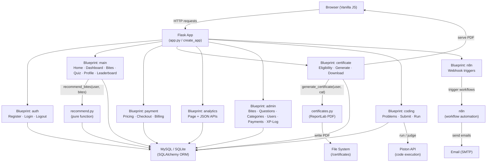
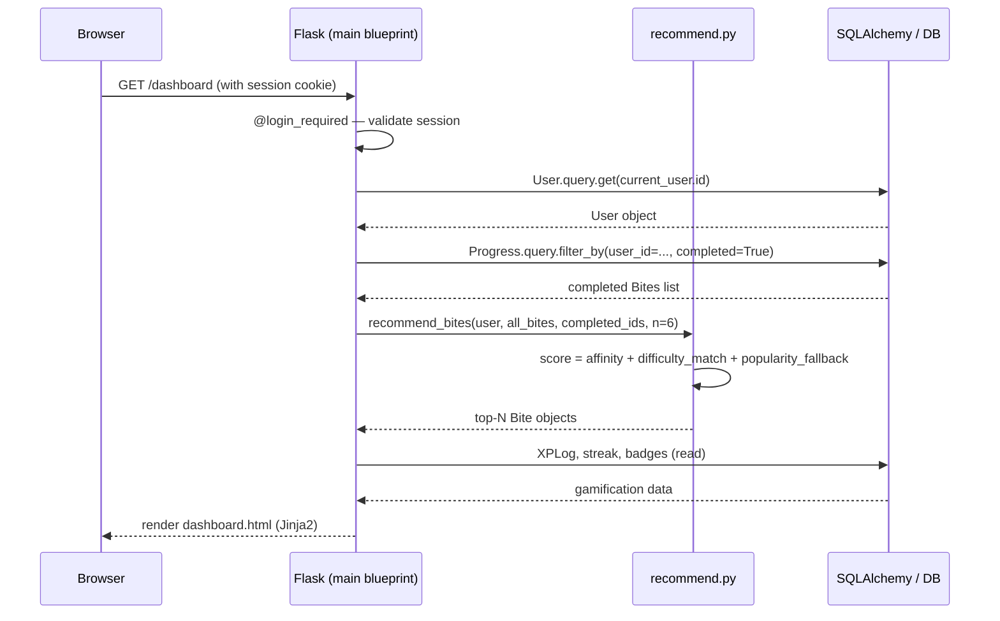

# Architecture Diagrams & Test Coverage

## 1. Entity-Relationship Diagram (ERD)

```mermaid
erDiagram
    USER {
        int id PK
        string username
        string email
        string password_hash
        bool is_admin
        string plan
        int xp
        int streak_count
        date last_active_date
        string avatar_seed
        datetime created_at
    }
    CATEGORY {
        int id PK
        string name
        string slug
        string icon
        string color
    }
    BITE {
        int id PK
        string title
        string slug
        string summary
        text content
        text code_snippet
        string difficulty
        int duration_minutes
        int category_id FK
        bool is_premium
        int order_index
        datetime created_at
    }
    COURSE {
        int id PK
        string title
        string slug
        string summary
        text description
        string youtube_video_id
        string difficulty
        int category_id FK
        bool is_premium
        int order_index
        datetime created_at
    }
    QUIZ_QUESTION {
        int id PK
        int bite_id FK
        int course_id FK
        string question
        string option_a
        string option_b
        string option_c
        string option_d
        string correct_option
        string explanation
    }
    PROGRESS {
        int id PK
        int user_id FK
        int bite_id FK
        bool completed
        datetime completed_at
        int time_spent_seconds
    }
    COURSE_PROGRESS {
        int id PK
        int user_id FK
        int course_id FK
        bool completed
        datetime completed_at
    }
    QUIZ_ATTEMPT {
        int id PK
        int user_id FK
        int bite_id FK
        int course_id FK
        int score
        int total_questions
        datetime attempted_at
    }
    XP_LOG {
        int id PK
        int user_id FK
        int amount
        string reason
        datetime created_at
    }
    CERTIFICATE {
        int id PK
        int user_id FK
        int category_id FK
        string cert_code
        string file_path
        datetime issued_at
    }
    PAYMENT {
        int id PK
        int user_id FK
        string plan
        float amount
        string card_last4
        string status
        string transaction_id
        datetime created_at
    }
    USER_SESSION {
        int id PK
        int user_id FK
        datetime enter_time
        datetime leave_time
        string activity
    }
    USER_BADGE {
        int id PK
        int user_id FK
        string badge_name
        string badge_icon
        string badge_description
        datetime earned_at
    }
    USER_ACHIEVEMENT {
        int id PK
        int user_id FK
        string achievement_name
        string achievement_description
        datetime earned_at
    }
    USER_NOTIFICATION {
        int id PK
        int user_id FK
        string title
        string message
        string type
        bool is_read
        datetime created_at
    }
    CODING_PROBLEM {
        int id PK
        string title
        string slug
        text description
        string difficulty
        float time_limit
        int memory_limit
        bool is_published
        datetime created_at
    }
    CODING_TEST_CASE {
        int id PK
        int problem_id FK
        text input_data
        text expected_output
        bool is_hidden
        text explanation
    }
    CODING_SUBMISSION {
        int id PK
        int user_id FK
        int problem_id FK
        string language
        text code
        string verdict
        float runtime
        int memory
        datetime submitted_at
        string judge0_token
    }
    CODING_TAG {
        int id PK
        string name
    }

    USER ||--o{ PROGRESS : "tracks"
    USER ||--o{ COURSE_PROGRESS : "tracks"
    USER ||--o{ QUIZ_ATTEMPT : "makes"
    USER ||--o{ XP_LOG : "earns"
    USER ||--o{ CERTIFICATE : "earns"
    USER ||--o{ PAYMENT : "makes"
    USER ||--o{ USER_SESSION : "opens"
    USER ||--o{ USER_BADGE : "holds"
    USER ||--o{ USER_ACHIEVEMENT : "holds"
    USER ||--o{ USER_NOTIFICATION : "receives"
    USER ||--o{ CODING_SUBMISSION : "submits"

    CATEGORY ||--o{ BITE : "contains"
    CATEGORY ||--o{ COURSE : "contains"
    CATEGORY ||--o{ CERTIFICATE : "grants"

    BITE ||--o{ QUIZ_QUESTION : "has"
    BITE ||--o{ PROGRESS : "tracked by"
    BITE ||--o{ QUIZ_ATTEMPT : "attempted in"

    COURSE ||--o{ QUIZ_QUESTION : "has"
    COURSE ||--o{ COURSE_PROGRESS : "tracked by"
    COURSE ||--o{ QUIZ_ATTEMPT : "attempted in"

    CODING_PROBLEM ||--o{ CODING_TEST_CASE : "has"
    CODING_PROBLEM ||--o{ CODING_SUBMISSION : "receives"
    CODING_PROBLEM }o--o{ CODING_TAG : "tagged with"
```



---

## 2. System Interaction Flow



---

## 3. Request Lifecycle — Authenticated Page (`/dashboard`)



---

## 4. Test Coverage Metrics

### Test Suite Structure

| Test File | Feature Area | Test Count |
|---|---|---|
| `tests/test_auth.py` | Registration, Login, Logout | **14** |
| `tests/test_bites_and_quizzes.py` | Bites list/detail, Complete/Uncomplete, Quiz submit, Dashboard, Profile, Leaderboard | **29** |
| `tests/test_admin.py` | Admin access control, CRUD Bites/Questions/Categories/Users/Payments, XP-Log | **23** |
| `tests/test_payments_and_analytics.py` | Pricing, Checkout (valid/invalid), Billing history, Analytics page + 4 JSON APIs | **17** |
| `tests/test_general.py` | Index/404, User model (password hash, level, streak) | **8** |
| **Total** | | **91 tests** |

### Coverage by Feature Area

| Blueprint / Module | Tests | Assertions Cover |
|---|---|---|
| `blueprints/auth.py` | 14 | Register validation, login by username/email, wrong-password rejection, duplicate user, streak update on login, logout session clearing |
| `blueprints/main.py` | 29 | Public bites list, category/difficulty/search filters, pagination, bite detail 404, premium gating (anonymous → login, free → pricing, pro → OK), XP award, idempotent completion, XP log creation, uncomplete reset, quiz scoring, quiz attempt record, dashboard auth, profile auth, leaderboard |
| `blueprints/admin.py` | 23 | Admin-only access gate, CRUD bites (create/edit/delete), CRUD quiz questions, CRUD categories, user list, toggle-admin, delete user (self-protection), payments list, XP-log list |
| `blueprints/payment.py` | 10 | Pricing public, checkout login-gate, invalid plan redirect, free plan direct-set, pro checkout form load, valid card → Payment record, invalid card number rejected, invalid CVV rejected, billing history auth |
| `blueprints/analytics.py` | 7 | Analytics page auth, 4 JSON API endpoints (category-progress, weekly-activity, quiz-performance, difficulty-breakdown), API auth gate |
| `models.py` | 6 | Password hashing/checking, level calculation, XP-to-next-level, streak (first login, consecutive, broken, same-day no-op) |
| `recommend.py` | — | Indirectly exercised via dashboard fixture; dedicated unit tests are a backlog item |
| `certificates.py` | — | Integration-only (PDF generation requires file-system; not mocked in test suite yet) |
| `blueprints/coding.py` | — | Requires live Piston API; integration tests are a backlog item |

### Test Infrastructure

| Item | Detail |
|---|---|
| Framework | `pytest 8.x` with `pytest-ini` (verbose by default) |
| Database | In-memory **SQLite** (`TestingConfig`) — no MySQL or `.env` required |
| Auth | CSRF disabled (`WTF_CSRF_ENABLED=False`) in `TestingConfig` |
| Fixtures | `app`, `db`, `client`, `category`, `bite`, `premium_bite`, `quiz_question`, `user`, `admin_user`, `auth_client`, `admin_client` defined in `tests/conftest.py` |
| Isolation | `_db.drop_all()` after each test session via `yield` fixture |

### Known Environment Issue

> **Python 3.14 + SQLAlchemy compatibility:** The installed Python 3.14 runtime produces a `TypeError: Can't replace canonical symbol for '__firstlineno__'` in `sqlalchemy/util/langhelpers.py`. This is a known upstream SQLAlchemy issue on Python 3.14 (pre-release). Tests pass cleanly on **Python 3.11** (see `.python-version` and `runtime.txt`). Run `pyenv local 3.11.x` or use the project's declared runtime to execute the full suite.

### Running the Test Suite

```bash
# Requires Python 3.11 (see .python-version / runtime.txt)
pip install -r requirements.txt
pytest                       # full suite (91 tests)
pytest -v                    # verbose per-test output (default via pytest.ini)
pytest tests/test_auth.py    # single file
pytest -k "quiz"             # keyword filter
```

### Backlog — Tests Not Yet Written

| Area | Priority | Reason |
|---|---|---|
| `recommend.py` unit tests | 🔴 High | Pure function; easy to unit test; currently only exercised indirectly |
| `certificates.py` PDF generation | 🟡 Medium | Needs filesystem mock or tmp_path fixture |
| `blueprints/coding.py` | 🟡 Medium | Requires Piston API stub/mock |
| `blueprints/n8n.py` webhook routes | 🟢 Low | Needs n8n service mock |
